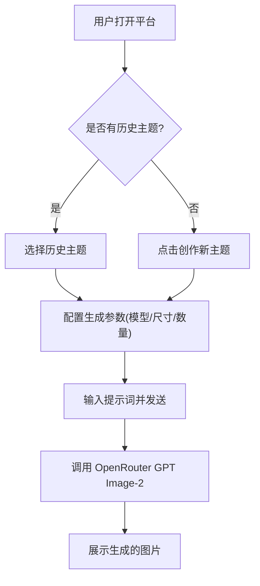

## 1. 产品概述
基于 OpenRouter 和 GPT Image-2 的 AI 图像生成对话平台。
- 为用户提供专业、高效的 AI 图像生成界面，支持自定义模型、图片尺寸及生成数量。
- 采用赛博全息控制台风格（Cyber Core）的深色主题，提供类似 ChatGPT 的高集成度交互体验。

## 2. 核心功能

### 2.1 功能模块
1. **侧边栏 (Sidebar)**：包含主题创建、搜索、历史记录列表（带缩略图），以及底部的升级引导。
2. **对话区 (Chat Area)**：展示历史对话和生成的图片，以及空状态提示“即刻创作 图片”。
3. **输入控制台 (Input Console)**：支持文本输入，集成模型切换、尺寸配置、生成数量配置及发送功能。

### 2.2 页面详细说明
| 页面名称 | 模块名称 | 功能描述 |
|----------|----------|----------|
| 主界面 | 侧边栏 | 支持新建对话主题，历史主题列表展示（包含生成图片缩略图），全息质感高亮。 |
| 主界面 | 聊天内容区 | 展示用户提示词与 AI 生成的图像流，支持点击放大查看图片。 |
| 主界面 | 创作输入区 | 多行文本输入，附加多维控制面板（模型选择、尺寸设定、图片数量设定），支持快捷键发送。 |

## 3. 核心流程
用户在侧边栏选择或新建主题，在输入区配置尺寸和数量，输入提示词后发送请求，系统调用 OpenRouter 接口并展示生成的图像。

## 4. 用户界面设计

### 4.1 设计风格
- **整体风格**：Web3 / AI 赛博全息控制台风格 (Cyber Core)，深色系，极度克制与专业。
- **色彩规范**：
  - 背景：极致深邃黑 (如 `#0A0A0A`)。
  - 面板/卡片：带有一丝通透感的深灰 (如 `#1A1A1A`)，辅以微弱的环境发光 (Ambient Glow)。
  - 强调色：赛博科技感的高亮色（如微光蓝或冷银白）。
- **按钮/交互**：
  - 扁平化，边缘锐利，悬停时带有丝滑的边缘发光效果 (Hover Glow)。
  - 弹出菜单采用紧凑的深色磨砂玻璃质感。
- **字体与排版**：中文字体，字号克制，布局紧凑，界限清晰，拒绝松散的居中卡片，追求高信息密度。
- **动效**：丝滑的打字机加载效果，微弱的赛博网格背景动画，极速响应。

### 4.2 页面设计概览
| 页面名称 | 模块名称 | UI 元素及交互 |
|----------|----------|---------------|
| 主界面 | 侧边栏导航 | 极简图标，紧凑列表，选中态带有环境发光和高对比度文字。 |
| 主界面 | 主操作区 | 纯净的深色背景，对话气泡去除多余装饰，聚焦图片本身。 |
| 主界面 | 浮动输入框 | 带有弥散阴影的深色输入框，内嵌 Naive UI 下拉菜单（模型、尺寸、数量选择）。 |

### 4.3 响应式设计
- 优先满足桌面端宽屏体验，侧边栏可折叠，主内容区自适应伸缩，保持布局的稳定与紧凑。
