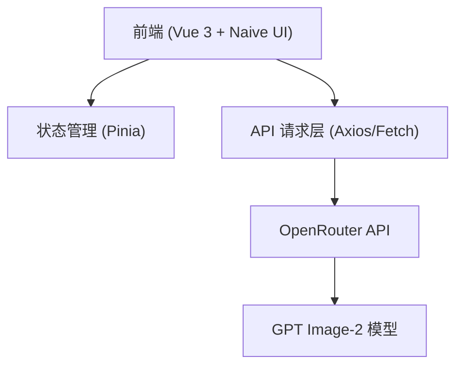

## 1. 架构设计


## 2. 技术栈说明
- **核心框架**：Vue 3 (Composition API)
- **UI 组件库**：Naive UI (完全匹配深色主题和赛博风格)
- **样式预处理器**：Sass (纯 SCSS 编写，**严禁使用 TailwindCSS**)
- **编程语言**：纯 JavaScript (ES6+，**严禁使用 TypeScript**)
- **状态管理**：Pinia
- **构建工具**：Vite

## 3. 路由定义
| 路由路径 | 页面说明 |
|----------|----------|
| `/` | 默认首页，集成侧边栏与主对话界面 |
| `/topic/:id` | 特定主题的对话界面 |

## 4. 核心数据结构
```javascript
// 会话主题
const topic = {
  id: 'string',
  title: 'string',
  thumbnail: 'string', // 最新生成图片的缩略图
  createdAt: 'number'
}

// 消息记录
const message = {
  id: 'string',
  topicId: 'string',
  role: 'user|assistant',
  type: 'text|image',
  content: 'string', // 文本内容或图片URL列表
  createdAt: 'number'
}

// 生成配置
const config = {
  model: 'gpt-image-2',
  size: '1024x1024',
  n: 1
}
```

## 5. 接口对接说明
- **目标端点**：`https://openrouter.ai/api/v1/chat/completions`
- **认证方式**：Bearer Token (需在环境变量中配置 `VITE_OPENROUTER_API_KEY`)
- **请求负载示例**：
```json
{
  "model": "openai/dall-e-3", 
  "messages": [
    {"role": "user", "content": "A cyber core holographic console..."}
  ]
}
```
*(注：OpenRouter 目前主要通过 `openai/dall-e-3` 或类似模型支持图像生成，具体模型标识根据实际支持情况调整，此处抽象为 gpt-image-2 的调用方式。)*

## 6. 样式与工程化规范
- **变量管理**：在 `src/styles/variables.scss` 中定义全局颜色、发光效果、阴影等。
- **组件样式**：采用 BEM 命名规范或 Vue Scoped 样式，保证样式隔离。
- **Naive UI 定制**：通过 `n-config-provider` 覆盖全局深色主题 (darkTheme) 变量，移除默认的圆角和过度留白，注入赛博朋克极简美学。
